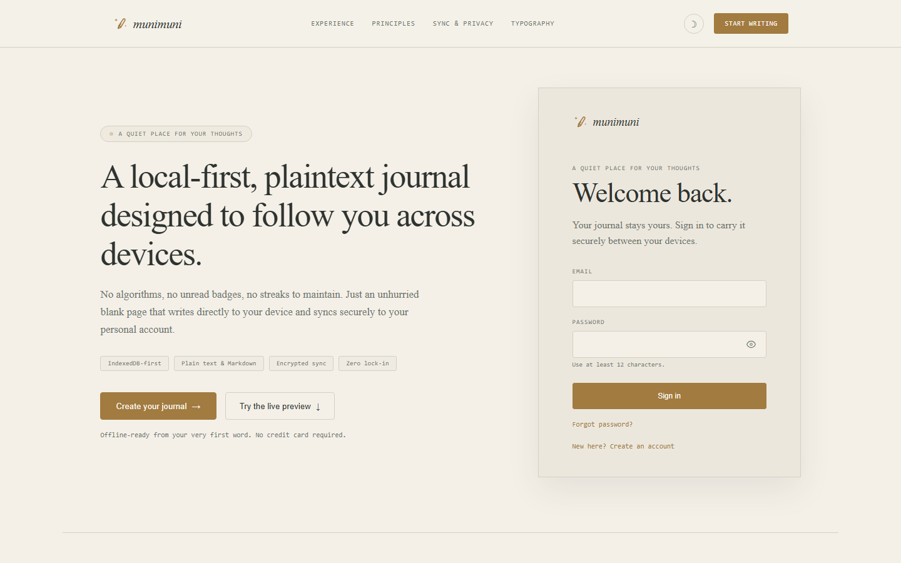
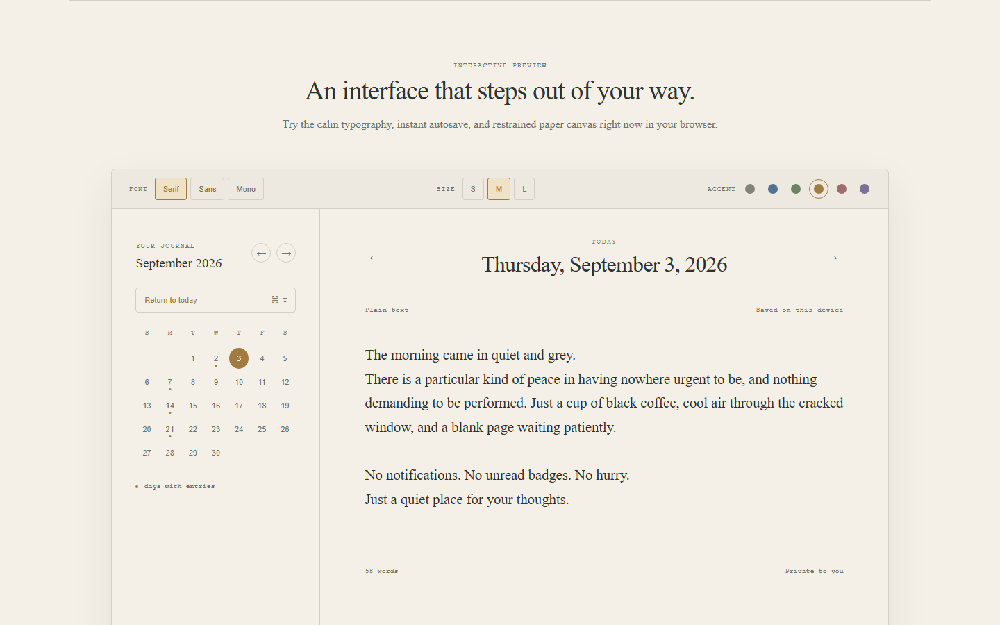
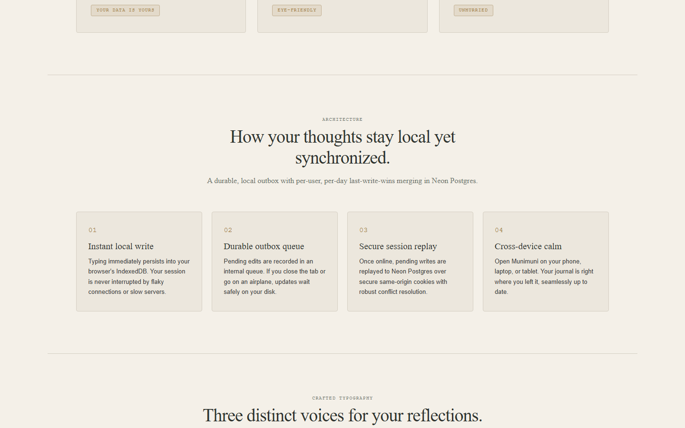
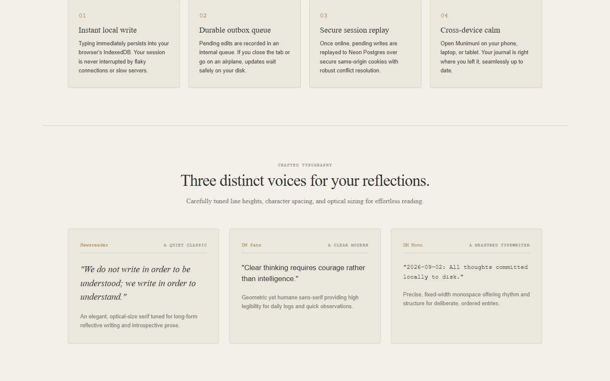

# Munimuni

**A quiet place for your thoughts: a local-first, plaintext journal that follows you across devices.**

Live demo: **https://munimuni.vercel.app**




No algorithms, no unread badges, no streaks. Just an unhurried blank page that writes to your device first and syncs securely to your personal account.

## What it is

- **Local-first journal** - IndexedDB is the first write target on web, a JSON state file on mobile, IndexedDB on desktop. The network is a backup, not a requirement.
- **Plaintext by principle** - entries are plain text with Markdown-friendly export. No proprietary format, no lock-in.
- **Three clients, one model** - web (full product), desktop (Tauri), and mobile (Expo) share the journal model in `packages/core`.
- **Calm by design** - paper-like editor, restrained accents, serif/sans/mono writing fonts, three sizes, system/light/dark modes.

## What it is not

- Not a notes app with folders and tags. It is date-based: today, the calendar, month reflections, year reflections.
- Not end-to-end encrypted (yet). Sync goes over HTTPS to your own Postgres rows scoped by `user_id`. See [Security](#security).
- Not a finished native release. Desktop and mobile are local-only today. Sync parity is on the [roadmap](#roadmap).

## Features

### Web (`apps/web`) - the full product

- Daily entries with prev/next day nav, "Return to today", monthly calendar with entry dots
- Month reflections (`YYYY-MM`) and year reflections (`YYYY`) alongside daily pages
- Debounced 700ms autosave to IndexedDB (`munimuni-local` v4, 6 stores) with `localStorage` fallback
- Durable outbox replay to `/api/sync` (auto after ~1200ms + manual Sync button) with `offline / syncing / synced / pending` states
- Version history (last 20 per day/year) with restore and delete
- Local backups (`munimuni.localBackup.YYYY-MM-DD`, last 8 shown) with restore
- Export matrix: day / month / year / full, each as Markdown or plain text (Blob download)
- Auth: Neon Auth sign-in/sign-up, 12-char minimum passwords, password recovery, first-run onboarding (display name + timezone)
- Landing page with interactive demo (try the editor without an account)
- Theming: system/light/dark, 6 accents (neutral/blue/green/amber/rose/violet), serif/sans/mono, small/medium/large
- PWA: installable (`Add to Home Screen` on mobile, install icon on desktop), offline shell `munimuni-shell-v1`, network-first navigations that skip `/api/`
- Mobile-responsive: bottom nav (Today/Calendar/Settings), editor scrolls internally above the keyboard




### Desktop (`apps/desktop`, Tauri v2 + Vite + React) - local-only subset

- Daily entries, calendar, word count, theming, Markdown/text export
- Native save dialog for exports (`@tauri-apps/plugin-dialog` + `plugin-fs`) with browser-download fallback
- Desktop touches: `Cmd/Ctrl+T` for today, `Cmd/Ctrl+,` for settings, `Esc` to close, drag region, 1360x860 window
- No auth, no sync, no month/year reflections yet. See [roadmap](#roadmap).

### Mobile (`apps/mobile`, Expo + React Native) - local-only subset

- Daily entries, calendar with entry dots, day navigation, theming, native share export
- Storage: single plaintext JSON `munimuni-state.json` in the app Documents directory
- Safe-area-aware layout with bottom tab bar and bottom-sheet calendar/settings
- No auth, no sync. The on-device outbox is retained but never sent: cookie sessions cannot work natively and a token exchange is required first. See [roadmap](#roadmap).

### Client parity

| Capability | Web | Desktop | Mobile |
| ---------- | --- | ------- | ------ |
| Daily entries | Yes | Yes | Yes |
| Month / year reflections | Yes | No | No |
| Version history + backups | Yes | No | No |
| Offline-first local writes | Yes (IndexedDB) | Yes (IndexedDB) | Yes (JSON file) |
| Cloud sync | Yes (`/api/sync`) | No | No (outbox retained) |
| Auth | Yes (Neon Auth) | No | No |
| Export | md/txt download | md/txt native save | md/txt native share |
| Installable | Yes (PWA) | Yes (`build:desktop`) | Expo Go only |

## Tech stack

- **Web:** Next.js 16 (App Router) + React 18, hand-rolled CSS (~1600 lines, no Tailwind in first-party code), Google Fonts (Newsreader / DM Sans / DM Mono / Cormorant / Playfair)
- **Shared model:** `@munimuni/core` (`JournalEntry`, `MonthReflection`, `YearReflection`, date helpers, word count) with Vitest coverage
- **Sync + identity:** Neon Postgres + Neon Auth (Better-Auth underneath), `@neondatabase/serverless`, Zod validation
- **Desktop:** Tauri v2, Vite 7, `plugin-dialog` / `plugin-fs` / `plugin-opener`
- **Mobile:** Expo 52, React Native 0.76, `expo-file-system`, `expo-sharing`, `react-native-safe-area-context`
- **DB:** Postgres migrations in `db/migrations` (001 journal + profiles, 002 month recaps, 003 rename to reflections, 004 year reflections)

## Quickstart

Prerequisites: Node 20+, npm.

```sh
npm install
npm run dev
```

Open the printed localhost URL. Core tests:

```sh
npm test
```

### Web (dev / build)

```sh
npm run dev      # Next.js dev (web only)
npm run build    # production build
```

After enabling Neon Auth, pull branch variables and set the cookie secret (32+ chars, same value in every environment):

```sh
npx neon@latest env pull --file apps/web/.env.local
npm run db:migrate
```

`apps/web/.env.local` needs: `DATABASE_URL`, `DATABASE_URL_UNPOOLED`, `NEON_AUTH_BASE_URL`, `NEON_AUTH_COOKIE_SECRET`. Add every deployed domain to Neon Auth trusted domains before signing in there.

### Desktop

```sh
npm run dev:desktop    # Tauri dev
npm run build:desktop  # Win/macOS/Linux installers
```

### Mobile

```sh
npm install
npm --workspace @munimuni/mobile run start
```

Open in Expo Go, an iOS simulator, or an Android emulator.

## Configuration

| Variable | Required | Where | Notes |
| -------- | -------- | ----- | ----- |
| `DATABASE_URL` | Yes (web) | server-only | Neon Postgres URL. Used by `apps/web/lib/db.ts`. |
| `DATABASE_URL_UNPOOLED` | Preferred | server-only | Used first by `scripts/migrate.mjs`. Falls back to `DATABASE_URL`. |
| `NEON_AUTH_BASE_URL` | Yes (web) | server-only | Your Neon Auth issuer URL. |
| `NEON_AUTH_COOKIE_SECRET` | Yes (web) | server-only | Stable 32+ char secret, identical across environments. Generate with `openssl rand -base64 32`. |
| `TEST_ACCOUNT_EMAIL` | E2E only | local | Must contain `test` (guard in seed/reset scripts). |
| `TEST_ACCOUNT_PASSWORD` | E2E only | local | 12+ chars. Never commit a real value. |
| `TEST_ACCOUNT_NAME` | E2E only | local | Display name for the seeded profile. |

Test account helpers (isolated by `user_id`, personal journal untouched):

```sh
npm run seed:test-account   # create test user + profile
npm run reset:test-account  # delete test journal_entries + reflections + profile
```

Sign in at `/auth/sign-in`. Onboarding auto-skips if a profile exists.

## Deploy your own (Vercel + Neon, ~10 min)

1. Fork this repo. Keep it private until you have read [Security](#security).
2. Create a Neon project with Auth enabled. Note the Postgres URL and Auth base URL.
3. Deploy to Vercel (root imports `apps/web`). Set server-only env vars: `DATABASE_URL`, `DATABASE_URL_UNPOOLED`, `NEON_AUTH_BASE_URL`, `NEON_AUTH_COOKIE_SECRET`.
4. Add your Vercel domains to Neon Auth trusted domains.
5. Run `npm run db:migrate` against the linked branch.
6. Open the deployed HTTPS URL. On mobile use **Add to Home Screen**; on desktop use the address-bar install action.

## Self-hosting (Docker)

Status: **works for web anywhere Node runs, but still needs Neon cloud for Postgres + Auth.** That is an honest limit, not a gimmick: a private journal should be hostable, and this gets you there without pretending the Neon dependency does not exist.

```sh
cp .env.example .env   # fill DATABASE_URL, NEON_AUTH_BASE_URL, NEON_AUTH_COOKIE_SECRET
docker compose up --build
npm run db:migrate     # run once against your DATABASE_URL
```

What is portable today:

- `apps/web/lib/db.ts` is 7 lines around `neon(process.env.DATABASE_URL)`. The SQL itself is vanilla Postgres (`DATE`/`TIMESTAMPTZ`, no exotic extensions).
- `next build && next start` runs anywhere. The only Vercel-specific bit is a `distDir` override that only applies on Vercel.

What is not portable yet:

- **Neon Auth is a hard dependency** (`lib/auth.ts`, `app/api/auth/[...path]`, `auth-client.ts`, `lib/session.ts`). Self-hosting without Neon means replacing auth (for example self-hosted Better-Auth) and rewiring `getCurrentUserId()`. That swap is roadmap, not v1.
- **Vanilla Postgres needs a driver swap.** `lib/db.ts` and `scripts/migrate.mjs` use `@neondatabase/serverless` (HTTP driver), which only talks to Neon. A `pg`-based path is the prerequisite for a fully local `docker-compose db` service.

If you just want your own instance with your own data, use the Docker path above with a Neon project you own. If you want zero third-party services, wait for the auth/driver abstraction on the roadmap - or send a PR.

## Architecture (the 60-second version)

```
device write (IndexedDB / JSON file)
  -> durable outbox (same device)
    -> POST /api/sync (authenticated, bounded, validated)
      -> Neon Postgres, per-user per-day last-write-wins on (updated_at, version)
```

- Stable IDs, timestamps, soft-delete (`deletedAt`), and a `version` field on every record.
- Server never trusts a `user_id` from the client. Ownership comes from the Neon Auth session (`lib/session.ts`).
- Sync ships at most 100 daily + 100 month + 100 year records per request; pulls are cursor-based (500 limit).
- Cross-origin state-changing requests are rejected; baseline security headers (`nosniff`, `Referrer-Policy`, `Permissions-Policy`) are set in `next.config.ts`.

## Security

- Production requires `DATABASE_URL`, `NEON_AUTH_BASE_URL`, and `NEON_AUTH_COOKIE_SECRET`. The dev fallback secret in `lib/auth.ts` never applies in production (it throws).
- Passwords: 12-char minimum, secure reset links, same-origin session cookies.
- RLS is enabled on all tables; enforcement today is app-level (`WHERE user_id = session`). Policies per table are a welcome hardening PR.
- Never commit `.env.local`, `.neon`, or `.vercel`. They are gitignored. Verify with `git ls-files | findstr env` before your first push to a public fork.
- See `SECURITY.md` for how to report vulnerabilities. The bundled `test@munimuni.test` account is for local E2E only.

## Roadmap

**Now (v0.1):** web is the deployable product; desktop/mobile are local-only companions.

**Next:**

- [ ] Desktop: month/year reflections parity, then sync via native token exchange
- [ ] Mobile: EAS builds + store metadata, then sync via native token exchange
- [ ] Desktop auto-updater (Tauri)
- [ ] Vanilla-Postgres path (`pg` driver option in `lib/db.ts` + `migrate.mjs`)
- [ ] Pluggable auth interface (`getCurrentUserId()`) so self-hosters can use Better-Auth/Auth.js
- [ ] Table-level RLS policies in `db/migrations`
- [ ] E2E suite around the test account (seed, write offline, replay outbox, LWW check)

Non-goals: folders/tags, social features, streaks, AI writing. The quiet stays quiet.

## Case study (why it is built this way)

**Problem.** Most journals are either offline-only (lose your history with the device) or cloud-first (blank page while loading, lock-in formats, noisy UX). Munimuni tries to keep both promises: instant local writes and durable multi-device history, in plaintext you can always take with you.

**Decision 1: local first, outbox second, server third.** The editor writes to IndexedDB (or a JSON file on mobile) on every debounced keystroke. A separate outbox table records what still needs the server. Sync replays the outbox after ~1200ms of quiet plus on demand. If the network fails, writing never breaks - only the `pending` badge changes. This is why offline feels instant and sync failures feel boring.

**Decision 2: boring merge.** Per-user, per-day last-write-wins on `(updated_at, version)` with stable IDs and soft deletes. No CRDTs, no conflict UI for v1. Journals are single-writer in practice; LWW is correct often enough and always understandable. Version history (20) + local backups (8) cover the "I overwrote something" case better than a merge dialog would.

**Decision 3: one model, three shells.** `packages/core` holds the only definitions of entry, month, year, and date keys. Web, Tauri, and Expo all import it. Platform code is only storage + chrome: IndexedDB vs JSON file, Blob download vs native save vs native share, PWA shell vs Tauri window vs Expo safe areas. When desktop/mobile gain sync, they reuse the same outbox contract instead of inventing a second protocol.

**Tradeoffs I made on purpose:**

- Neon Auth over self-hosted auth: faster to ship securely, but it is the one hard vendor lock. The seam (`getCurrentUserId()`) is small and documented for later.
- Hand-rolled CSS over Tailwind: the whole product is typography and spacing. One stylesheet, zero utility churn, full control of the paper feel.
- PWA before app stores: installable today on iOS/Android/desktop browsers with an offline shell, no review queue. Native shells (Tauri/Expo) exist and are honest about being local-only until token sync lands.

**What I would do next.** The highest-leverage work is native sync parity (token exchange for Tauri + Expo against the existing `/api/sync` contract), then the vanilla-Postgres + pluggable-auth cut for true zero-vendor self-hosting. Everything else is polish.

## Contributing

- Keep commits to one coherent change. No `Co-authored-by` trailers.
- Preserve local-first + plaintext principles. Small, maintainable PRs win.
- Bug fixes start with an E2E reproduction close to how a user hits it.
- Run `npm test` (core) and `npm run build` (web) before pushing.
- Never commit secrets, `.env.local`, `.neon`, or `.vercel` files.

## License

MIT - see [LICENSE](LICENSE). Copyright 2026 Exequel Adizon.
